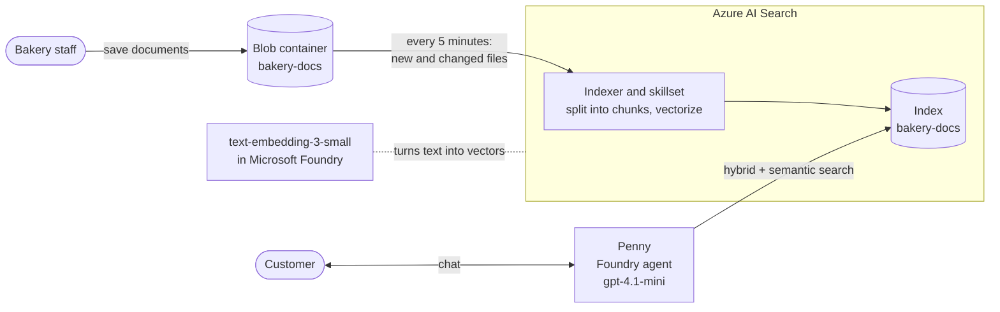

# Azure AI Search for AI agents

**Give your AI agent a real search engine.** Sample files for part 2 of the Blue Penguin Bakery
series on the Infra2AI YouTube channel, where we build **Penny**, an AI assistant for a fictional
bakery, in Microsoft Foundry.

**Watch:** [the series on YouTube](https://www.youtube.com/playlist?list=PLUKvmDqPth-M) ·
**Part 1 code:** [infra2ai/first-ai-agent](https://github.com/infra2ai/first-ai-agent)

## The story so far

In [part 1](https://github.com/infra2ai/first-ai-agent) we built Penny in Microsoft Foundry. She
answered from six small files uploaded with *File search*, analysed sales data, and checked orders
through the bakery's own API.

Then the bakery grew: a second shop in Oerlikon, PDF product sheets, and weekly specials that change
every Monday. Uploading files to the agent by hand no longer keeps up, so in this part Penny gets a
real search engine:

- the documents live in an **Azure Storage** container, where the bakery simply saves them
- **Azure AI Search** splits them into chunks, turns them into vectors with an embedding model,
  and keeps the index up to date on a schedule
- Penny searches the index with **hybrid search** (keywords and vectors) and the **semantic ranker**
- when a document changes, the indexer reads only that file again, and Penny's answer changes
  without anyone touching the agent

## The series

| Part | Video | What Penny learns | Code |
|---|---|---|---|
| 1 | Build your first AI agent on Azure | Answers from files, analyses data with code, calls the bakery's order API, guardrails, tracing, and her own website | [infra2ai/first-ai-agent](https://github.com/infra2ai/first-ai-agent) |
| 2 | Azure AI Search for AI agents | Searches all of the bakery's documents, always up to date | This repository |
| 3 | Coming next: multiple agents | A teammate with a job of its own | |

All videos are in the [series playlist](https://www.youtube.com/playlist?list=PLUKvmDqPth-M).

## How it works

1. The bakery saves its documents into a **Blob Storage container**.
2. An **indexer** reads the container on a schedule. Its **skillset** splits each document into
   chunks and calls the **embedding model** to turn every chunk into a vector
   ([integrated vectorization](https://learn.microsoft.com/en-us/azure/search/vector-search-integrated-vectorization)).
   Each run reads only new and changed files.
3. The **index** stores the text and the vectors together. A search runs a keyword search and a
   vector search at the same time ([hybrid search](https://learn.microsoft.com/en-us/azure/search/hybrid-search-overview)),
   then the [semantic ranker](https://learn.microsoft.com/en-us/azure/search/semantic-search-overview)
   puts the most useful results first.
4. Penny searches the index through the **Azure AI Search tool** in Foundry
   ([Connect an Azure AI Search index to Foundry agents](https://learn.microsoft.com/en-us/azure/foundry/agents/how-to/tools/ai-search)).

## What is in this repository

| Path | Contents | Used in the video for |
|---|---|---|
| [`data/bakery-docs/`](data/bakery-docs) | 32 bakery documents: 18 text files (shops, opening hours, allergies, menu and prices, delivery, catering, weekly specials for week 41, and more) and 14 PDF product sheets | Uploading to the storage container |
| [`data/updates/weekly-specials.txt`](data/updates/weekly-specials.txt) | The next week's specials (week 42), with the same file name | Changing a document |
| [`agent/instructions.txt`](agent/instructions.txt) | Penny's instructions from part 1 | Starting point |
| [`agent/instructions-with-search.txt`](agent/instructions-with-search.txt) | The same, plus the line added in this video: *Search the bakery's documents for every question, even if you searched before.* | Connecting Penny to the index |

Blue Penguin Bakery is fictional, and so is everything in its documents.

## What you need

- An Azure subscription where you can create resources: **Contributor** (or higher) on the
  resource group, and **Foundry User** (or higher) on the Foundry resource to work with agents.
  Microsoft recently renamed this role; you may still see its old name, *Azure AI User*
  ([Foundry roles](https://learn.microsoft.com/en-us/azure/foundry/concepts/rbac-foundry)).
- **Penny from part 1**: a Microsoft Foundry resource and project with a `gpt-4.1-mini`
  deployment, and the agent `penny`. If you don't have her yet, follow steps 1 to 3 of
  [part 1's step by step](https://github.com/infra2ai/first-ai-agent#step-by-step). Step 4 (her six
  files) is optional, because this part replaces it.

The video uses the Switzerland North region. Keep the storage account and the search service in
the same region as your Foundry resource.

## What it costs

- **Azure AI Search, Basic tier**: about 0.10 USD an hour for as long as the service exists,
  whether anyone searches it or not ([pricing](https://azure.microsoft.com/en-us/pricing/details/search/)).
  This is most of the cost.
- **Semantic ranker**: its free plan includes a monthly allowance of requests at no charge
  ([billing](https://learn.microsoft.com/en-us/azure/search/semantic-how-to-enable-disable)).
- **Embedding model and gpt-4.1-mini**: billed per token, a few cents for 32 short documents and a
  handful of questions.
- **Storage**: a few cents.

Following along costs well under a dollar if you delete everything the same day
(see [Clean up](#clean-up)).

## Step by step

1. **Create a storage account and upload the documents.** In the Azure portal, create a storage
   account in Penny's resource group (*Primary service*: Azure Blob Storage, *Redundancy*: LRS).
   On its overview, click **Upload**, create a container named `bakery-docs`, and upload everything
   in [`data/bakery-docs/`](data/bakery-docs).
   ([Create a storage account](https://learn.microsoft.com/en-us/azure/storage/common/storage-account-create),
   [Upload blobs in the portal](https://learn.microsoft.com/en-us/azure/storage/blobs/storage-quickstart-blobs-portal))
2. **Create the search service.** Search the portal for *AI Search* and create a service in the
   same resource group. Choose the region first, then click **Change Pricing Tier** and pick
   **Basic**: changing the region resets the tier to Standard.
   ([Create a search service](https://learn.microsoft.com/en-us/azure/search/search-create-service-portal),
   [Pricing tiers](https://learn.microsoft.com/en-us/azure/search/search-sku-tier))
3. **Deploy an embedding model.** In the Foundry portal, open the model catalog, find
   `text-embedding-3-small`, and deploy it with the default settings.
   ([Deploy models in the Foundry portal](https://learn.microsoft.com/en-us/azure/foundry/foundry-models/how-to/deploy-foundry-models))
4. **Build the index.** On the search service, click **Import data**, then *Azure Blob Storage*
   and *RAG*:
   - pick the storage account and the `bakery-docs` container
   - vectorize the text with your Foundry project and the `text-embedding-3-small` deployment,
     and acknowledge the cost notice
   - keep the semantic ranker on, and set the schedule to every 5 minutes (hourly is plenty for
     real use)
   - name the objects `bakery-docs`, and click **Create**

   The wizard creates a data source, an index, a skillset and an indexer. The first run takes
   about a minute.
   ([Quickstart: vector search in the portal](https://learn.microsoft.com/en-us/azure/search/search-get-started-portal-import-vectors),
   [Indexer schedules](https://learn.microsoft.com/en-us/azure/search/search-howto-schedule-indexers))
5. **Try the index.** Open *Search explorer*, click **Refresh** until the index shows 32
   documents, and search for *Is the Oerlikon shop open on Sundays?*
   ([Search explorer](https://learn.microsoft.com/en-us/azure/search/search-explorer))
6. **Connect the search service to the Foundry project.** In Foundry, open
   *Tools > Connect a tool > Azure AI Search > Add tool*, pick your search service, and click
   **Connect**.
7. **Give Penny the index.** Open *Agents > penny*. Under *Tools*, click
   *Add > Add tools > Azure AI Search > Add tool*. In the new tool, open *Select a search index*,
   choose *Connect to a new resource or index*, pick the connection and the `bakery-docs` index,
   and click **Add**.
   ([Connect an Azure AI Search index to Foundry agents](https://learn.microsoft.com/en-us/azure/foundry/agents/how-to/tools/ai-search))
8. **Tune Penny.** In the tool's *Parameters*, set *Search type* to **Hybrid + semantic**. If
   Penny still has the *File search* tool from part 1, disconnect it, so the index is her only
   source. Replace her instructions with
   [`agent/instructions-with-search.txt`](agent/instructions-with-search.txt), and click **Save**.
9. **Ask Penny**: *Is your shop in Oerlikon open on Sundays?*, *Do you have anything
   gluten-free?* and *What's this week's special?* Under each answer, an `azure_ai_search_call`
   step shows that she searched the index.
10. **Change a document.** Upload [`data/updates/weekly-specials.txt`](data/updates/weekly-specials.txt)
    to the container, with *Overwrite if files already exist*. Wait for the next scheduled run, or
    open *Indexers > bakery-docs-indexer* and click **Run**: the run processes one document. Ask
    Penny for this week's special again. She now knows week 42, and nobody touched her.
    ([Changed and deleted blobs](https://learn.microsoft.com/en-us/azure/search/search-how-to-index-azure-blob-changed-deleted))

## Troubleshooting

| What you see | What to do |
|---|---|
| Search explorer shows 0 documents right after the import | The first run takes about a minute, and the numbers on the index page lag a little behind. Wait, then click **Refresh**. |
| The pricing tier went back to Standard | Changing the region resets the tier. Choose the region first, then the tier. |
| Creating the search service fails with *a background operation is still in progress* | The name belongs to a search service deleted a few minutes ago. Wait about 15 minutes, or choose another name. |
| The tool's *Parameters* show no search types | Add the index from Penny's own *Add > Add tools* menu (step 7), not with *Use in an agent* on the connection page. |
| Penny says she doesn't know, and no `azure_ai_search_call` step appears | Check that her instructions end with the line from [`instructions-with-search.txt`](agent/instructions-with-search.txt), and that you clicked **Save**. Without it, she sometimes skips the search on later questions in a chat. |
| A run started by hand processes 0 documents | Nothing changed since the last run: a scheduled run already picked up the new file. |

## Before you use this for real

- **Use managed identities instead of keys.** This walkthrough keeps the defaults, which use keys:
  the indexer reads the container with the storage account key, the skillset calls the embedding
  model with an API key, and Foundry connects to the search service with an API key. In production:
  - turn on the search service's managed identity, and give it **Storage Blob Data Reader** on the
    storage account ([Connect to Azure Storage](https://learn.microsoft.com/en-us/azure/search/search-howto-managed-identities-storage))
    and **Cognitive Services OpenAI User** on the Foundry resource
    ([Azure OpenAI Embedding skill](https://learn.microsoft.com/en-us/azure/search/cognitive-search-skill-azure-openai-embedding))
  - give the Foundry resource's managed identity **Search Index Data Contributor** and
    **Search Service Contributor** on the search service, and choose the managed identity when you
    create the connection
    ([Connect an Azure AI Search index to Foundry agents](https://learn.microsoft.com/en-us/azure/foundry/agents/how-to/tools/ai-search))
- **Track deletions.** A schedule finds new and changed files, but deleted files stay in the index
  unless you turn on *Enable deletion tracking* when you import the data. It relies on the storage
  account's blob soft delete (the portal turns it on by default for new storage accounts), and it
  has to be on from the indexer's first run
  ([Changed and deleted blobs](https://learn.microsoft.com/en-us/azure/search/search-how-to-index-azure-blob-changed-deleted)).
- **Pick a sensible schedule.** Every 5 minutes is for the demo. Hourly or daily is plenty for
  most businesses ([Indexer schedules](https://learn.microsoft.com/en-us/azure/search/search-howto-schedule-indexers)).

## Clean up

Delete the resource group when you're done. It removes Penny, the storage account and the search
service. The search service is what costs money while it exists, so to keep Penny for the next
part, delete only the search service.

A deleted Foundry resource is kept for 48 hours, and its name can't be reused until then. To
create a new one with the same name sooner, purge it
([Recover or purge deleted Foundry resources](https://learn.microsoft.com/en-us/azure/ai-services/recover-purge-resources)).

## Learn more

- [What is Azure AI Search?](https://learn.microsoft.com/en-us/azure/search/search-what-is-azure-search)
- [RAG and generative AI in Azure AI Search](https://learn.microsoft.com/en-us/azure/search/retrieval-augmented-generation-overview)
- [Integrated vectorization](https://learn.microsoft.com/en-us/azure/search/vector-search-integrated-vectorization),
  [hybrid search](https://learn.microsoft.com/en-us/azure/search/hybrid-search-overview) and the
  [semantic ranker](https://learn.microsoft.com/en-us/azure/search/semantic-search-overview)
- [Index Azure Blob Storage](https://learn.microsoft.com/en-us/azure/search/search-how-to-index-azure-blob-storage)
- [Connect an Azure AI Search index to Foundry agents](https://learn.microsoft.com/en-us/azure/foundry/agents/how-to/tools/ai-search)
- [What is Foundry IQ?](https://learn.microsoft.com/en-us/azure/foundry/agents/concepts/what-is-foundry-iq):
  the managed knowledge layer for agents, built on Azure AI Search
- [Service limits](https://learn.microsoft.com/en-us/azure/search/search-limits-quotas-capacity)
  and [pricing](https://azure.microsoft.com/en-us/pricing/details/search/)

## Next

So far Penny does everything herself. In part 3 she gets a teammate: a second agent with a job of
its own, and Penny handing questions over to it. Follow the
[series playlist](https://www.youtube.com/playlist?list=PLUKvmDqPth-M) so you don't miss it.
